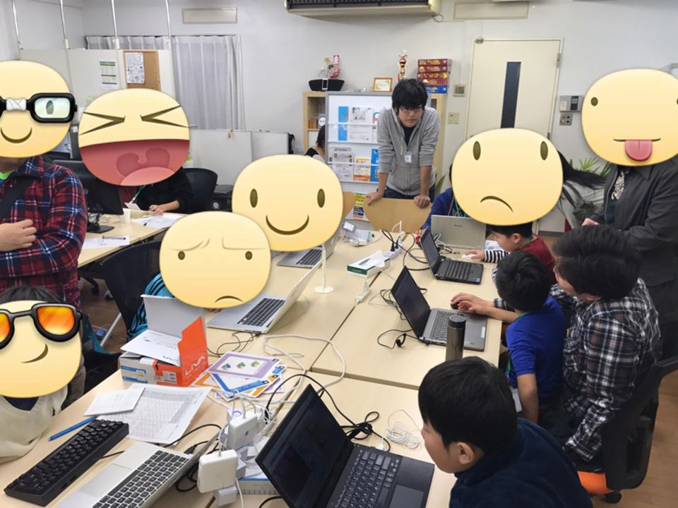
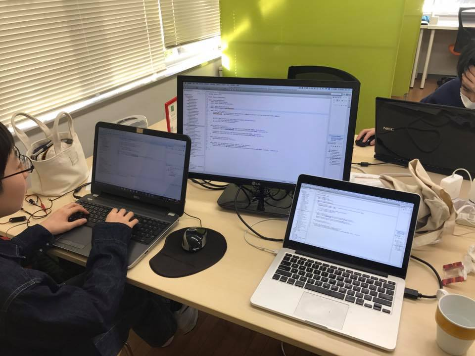

## 第34回 CoderDojo Chiba 開催レポート

2016年12月18日に、[201千葉コーワーキング](http://chiba-coworking.com/) にて、第34回 CoderDojo Chiba が開催されました。

### Scratch部の様子

Ninja (プログラマー見習い) 13名、メンター4名が参加しました。

### MineCraft MOD部の様子

### 会計報告

寄付制による運用は、2017年の1月からになりますが、7,500円頂きました。残高は、9,500円になります。

直近では、以下で利用する予定です。

- 寄付が集まらなかった時に備えたプール金 (会場費のため)
- メンター・ボランティアスタッフの保険代 (年650円/人)
- 資料印刷代

[会計報告](https://docs.google.com/spreadsheets/d/1CZFh12z510NRKdzXc862R2ItwGIktRD1huCYmIGbwFc/edit?usp=sharing)

以上です
