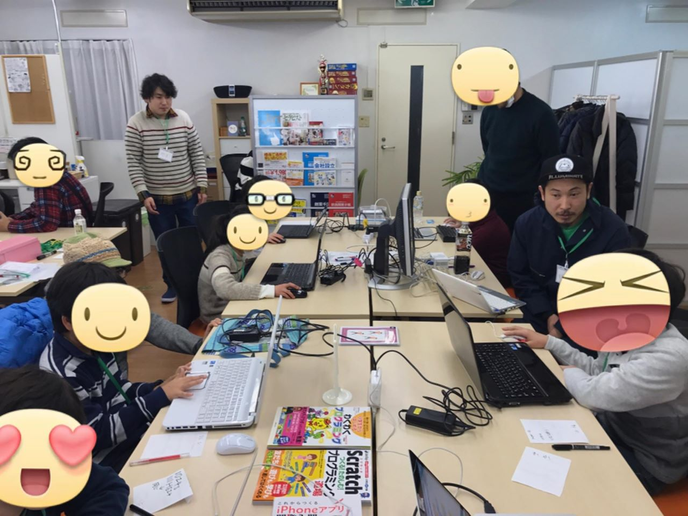
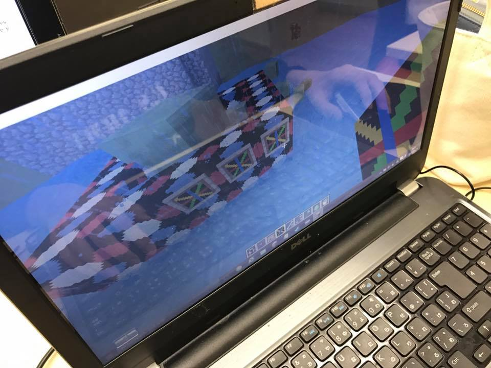

## 第35回 CoderDojo Chiba 開催レポート

2017年1月29日(日)に、[201千葉コーワーキング](http://chiba-coworking.com/) にて、第35回 CoderDojo Chiba が開催されました。

### Scratch部の様子

Ninja (プログラマー見習い) 9人、メンター5人が参加しました。

2人のNinjaが、作った作品を発表してくれました！ありがとうございます。

### MineCraft MOD部の様子

Ninja 2人が参加しました。1人は、新しいアイテムと、ブロックを定義して
ゲーム中に登場させました。

次回は、アイテムに新しいアクションを追加します。

### 会計報告

今月から、寄付制による運用に変更になりました。

前回開催から今回の開催までに、31,500円の寄付をいただきました。

1月開催では、合計で14,000円の寄付をいただきました。1月分会場費として、12,000円を支払ました。
ボランティア活動保険として、2,100円を拠出し、残高は40,900円となります。

直近では、以下で利用する予定です。

- 寄付が集まらなかった時に備えたプール金 (会場費のため)
- 書籍購入

[会計報告](https://docs.google.com/spreadsheets/d/1CZFh12z510NRKdzXc862R2ItwGIktRD1huCYmIGbwFc/edit?usp=sharing)

以上です
