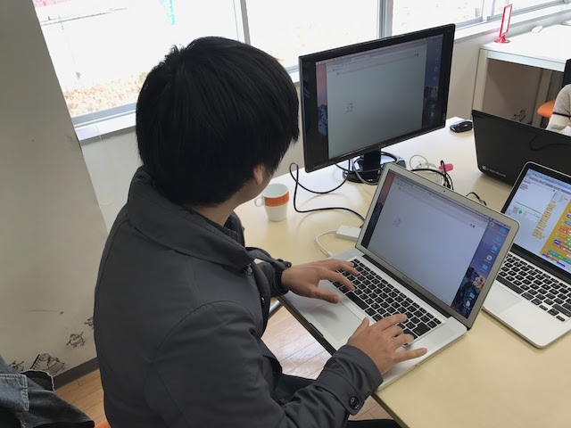
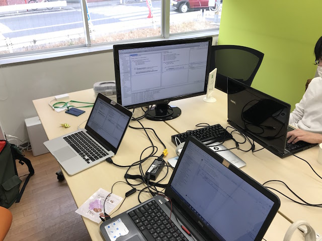

## 第36回 CoderDojo Chiba 開催レポート

2017年2月18日(土)に、[201千葉コーワーキング](http://chiba-coworking.com/) にて、第36回 CoderDojo Chiba が開催されました。

### Scratch部の様子

Ninja (プログラマー見習い) 3人、メンター5人が参加しました。

今回は、告知期間が短かったこともあり、少人数での開催となりました。
メンターになりたての人も多い状態なので、メンターの方に率先して作った作品を発表していただきました！

ありがとうございます。

### MineCraft MOD部の様子

Ninja 2人が参加しました。 Forge 1.11.2 へのバージョンアップ作業を行い、
過去のバージョンとの互換性のないコードの書き換えを行いました。

また

- 食べてもなくならないりんご
- 持ってるだけでダメージを受けるアイテム

を作成しました。

### 会計報告

2月開催では、8,000円の寄付をいただきました。2月分会場費として、7,000円を支払いました。

直近では、以下で利用する予定です。

- 寄付が集まらなかった時に備えたプール金 (会場費のため)
- こども用の小さなマウス3個購入
- ボランティア保険加入 (4月〜)

[会計報告](https://docs.google.com/spreadsheets/d/1CZFh12z510NRKdzXc862R2ItwGIktRD1huCYmIGbwFc/edit?usp=sharing)

以上です。
