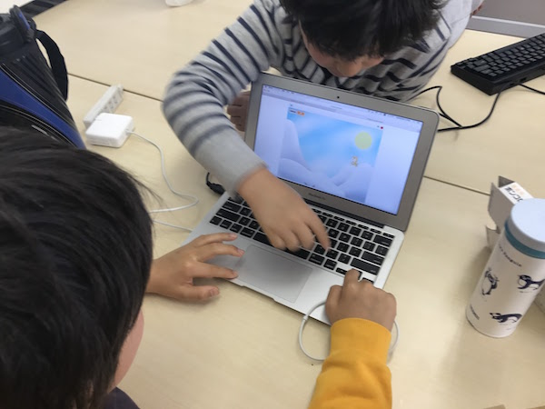
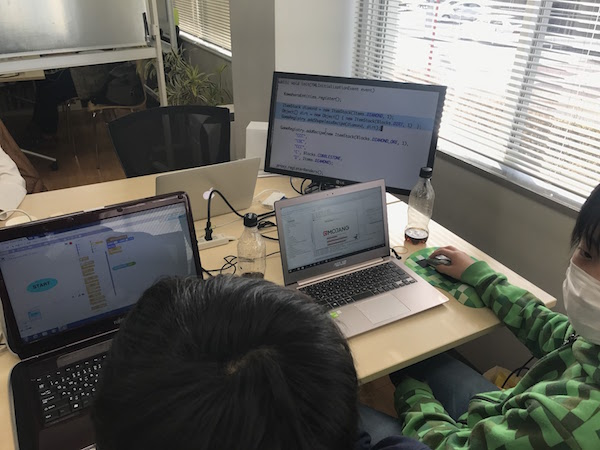
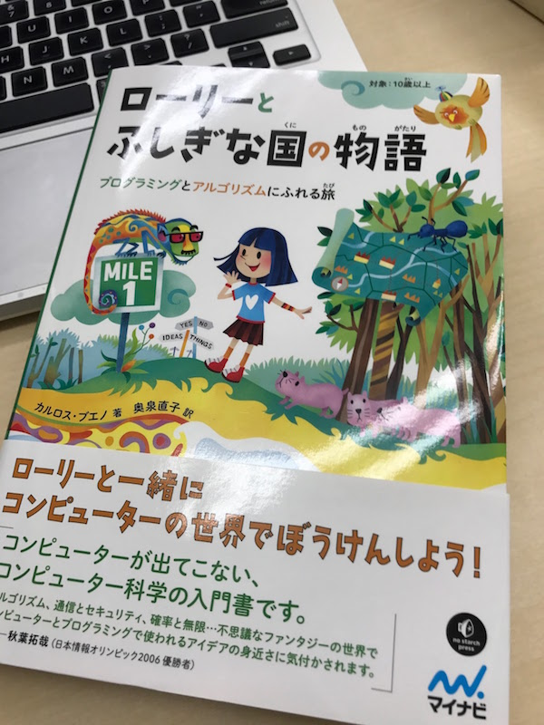

## 第37回 CoderDojo Chiba 開催レポート

2017年3月20日(月)に、[201千葉コーワーキング](http://chiba-coworking.com/) にて、第37回 CoderDojo Chiba が開催されました。

### Scratch部の様子

Ninja (プログラマー見習い) 15人、メンター5人が参加しました。

祝日ということもあり、大賑わいでした。初心者コーナーでは6人が一緒に作品を作り、
最後に4人が作成した作品を、みんなの前で発表してくれました。

ありがとうございます。

### MineCraft MOD部の様子

Ninja 6人が参加しました。CoderDojo Chiba 午後の部としては、最も人数の多い回です。
初めての人もいるので、

- セットアップ
- MODづくりの基本のき (土をダイヤモンドに変える)

を実施しました。

参加者どうしで教え合う場面もあり、とても良い雰囲気でした。

### 献本

株式会社マイナビ出版様より[『ローリーとふしぎな国の物語』](https://www.amazon.co.jp/%E3%83%AD%E3%83%BC%E3%83%AA%E3%83%BC%E3%81%A8%E3%81%B5%E3%81%97%E3%81%8E%E3%81%AA%E5%9B%BD%E3%81%AE%E7%89%A9%E8%AA%9E-~%E3%83%97%E3%83%AD%E3%82%B0%E3%83%A9%E3%83%9F%E3%83%B3%E3%82%B0%E3%81%A8%E3%82%A2%E3%83%AB%E3%82%B4%E3%83%AA%E3%82%BA%E3%83%A0%E3%81%AB%E3%81%B5%E3%82%8C%E3%82%8B%E6%97%85~-%E3%82%AB%E3%83%AB%E3%83%AD%E3%82%B9%E3%83%BB%E3%83%96%E3%82%A8%E3%83%8E/dp/4839961085)を献本いただきました。

ファンタジーな物語を通して、コンピューター科学の考え方を学べる内容です。
「コンピュータ」や「プログラミング」しないため、特に普段コンピューターに慣れ親しんでいない人でも
コンピューターの考え方を学ぶことができます。

現在、Championの川原が保管しておりますが、CoderDojo Chiba 開催時には参加者の目の届く
ところに並べておきます。気になる方はぜひご覧ください！

### 会計報告

3月開催では、12,000円の寄付をいただきました。3月分会場費として、12,000円を支払いました。

直近では、以下で利用する予定です。

- 寄付が集まらなかった時に備えたプール金 (会場費のため)
- こども用の小さなマウス3個購入, ローマ字表つきマウスパットの購入
- ボランティア保険加入 (4月〜)

[会計報告](https://docs.google.com/spreadsheets/d/1CZFh12z510NRKdzXc862R2ItwGIktRD1huCYmIGbwFc/edit?usp=sharing)

### 次回開催

次回開催は、**4月29日(土)**を予定しております！

<a href="https://goo.gl/forms/6BCB8jzTkYpO6DEv1" target="_blank">応募はこちらから</a>
