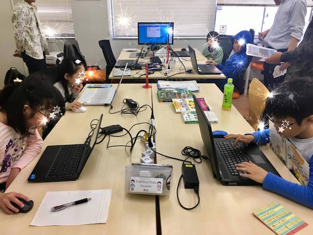
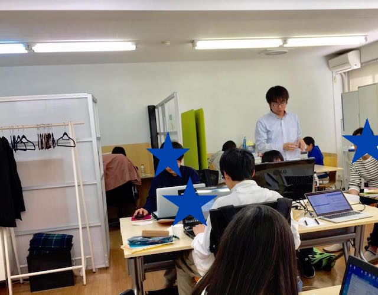

## 第38回 CoderDojo Chiba 開催レポート

2017年4月29日(土)に、[201千葉コーワーキング](http://chiba-coworking.com/) にて、第38回 CoderDojo Chiba が開催されました。

## 午前Scratch部の様子

Ninja (プログラマー見習い) 7人、メンター3人が参加しました。

今回は、初心者が3名で、はじめてのプログラミングにチャレンジしました。

最後に、途中まで完成している作品を、見せてくれるNinjaも登場してくれました。
[Softalk](https://www35.atwiki.jp/softalk/)を使った、ストーリー解説も行っていて、なかなかのこだわりを感じました。

ありがとうございます。

### 午後の部の様子

Ninja 5人が参加しました。それぞれの課題をこなしていきました。

MineCraft MOD作りにチャレンジしているNinjaは、

- Java開発環境 セットアップ
- ブロックの新規作成
- 投げられる爆弾の作成

など、多義に渡ってチャレンジしました。

- 問題がでたらログを呼んで問題を解決
- わからない場合GitHubにある他の人のコードを読んでみる

など、少し難しい課題もこなしています。

### 会計報告

4月開催では、13,500円の寄付をいただきました。

以下の支出があります。

- 4月分会場費: 10,000円
- ローマ字マウスパッド5枚購入 1,650円
- 小型マウス3個購入 (こどもの手に通常のマウスが合わない事があるため購入しました。) 2,577円

直近では、以下で利用する予定です。

- 寄付が集まらなかった時に備えたプール金 (会場費のため)

[会計報告](https://docs.google.com/spreadsheets/d/1CZFh12z510NRKdzXc862R2ItwGIktRD1huCYmIGbwFc/edit?usp=sharing)

### 次回開催

次回開催は、**6月3日(土)**を予定しております！

5月が多忙なため、6月開催となってしまいました。千葉県には、[ほかにもCoderDojo を開催している場所](http://coderdojo.chiba.jp/)がありますので、
そちらも参照してみてください！

また、**5月14日(日)** には、柏のほうで [ScratchDay in Kashiwa](http://sd.coderdojo-kashiwa.com/) が開催されます。

- 自分の作品を見せたい！
- 完成してないのだけど、とにかく見せてアドバイスをもらいたい
- その他、Scratchに興味がある

な方はぜひ行ってみてください！

<a href="https://goo.gl/forms/6BCB8jzTkYpO6DEv1" target="_blank">応募はこちらから</a>
