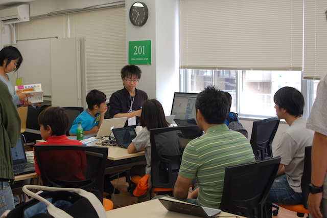
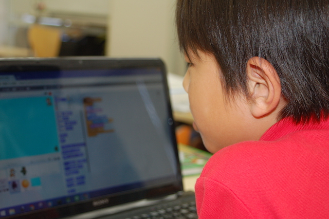

## 第39回 CoderDojo Chiba 開催レポート

2017年6月3日(土)に、[201千葉コーワーキング](http://chiba-coworking.com/) にて、第39回 CoderDojo Chiba が開催されました。

## 午前の部の様子

Ninja (プログラマー見習い) 6名が、メンター4名が参加しました。

今回から、CoderDojo の名札システムを一新して、「今まで何をやってきたか」「できるようになったこと」が一見でわかるようになりました。
名札はみなさんが持ち帰るようになっているので、次回以降もできることを少しづつ増やしていて互いに教えあって貰えばと思います。

みんなの前で発表する人は居ませんでしたが、最後にみんなで作品を見せ合いました。

## 午後の部の様子

午前に引き続き、ScratchをやるNinjaが2名と、MineCraft MODづくりにチャレンジするNinjaが2名でした。

今回は、MineCraft 内で「近くにあるアイテム(Entity)を引き寄せたい」という課題があったため球体の方程式にチャレンジしました。

## 次回開催

6月開催で、11,000円の寄付をいただきました。

4月開催から、以下の支出が発生しています:

- 6月分会場費: 9,000円
- SDカード購入: 1,160円
- 名札ホルダ: 3,950円
- 名札用台紙: 1,730円

次回開催は、**7月17日(月, 祝)** です。夏休み前ですね!
プログラミングを自由研究の制作の素材として使うことができるかもしれません。課題が決まっているのであれば、持ってきて頂いて課題をこなしてもよいです。
メンターが直接介入することはないですが、ヒントやコンピューターを使ってできることを教えてくれるかもしれません。

<a href="https://goo.gl/forms/6BCB8jzTkYpO6DEv1" target="_blank">応募はこちらから</a>
