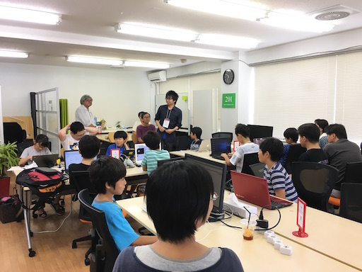
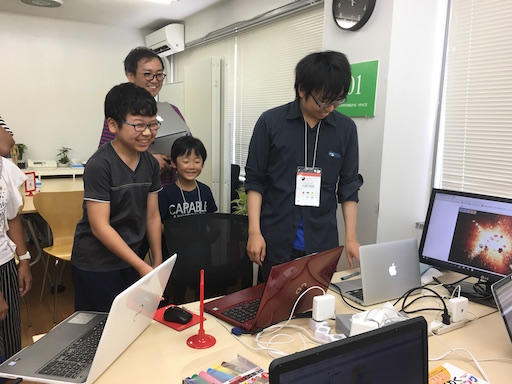

## 第40回 CoderDojo Chiba 開催レポート

2017年7月17日(月, 祝)に、[201千葉コーワーキング](http://chiba-coworking.com/) にて、第40回 CoderDojo Chiba が開催されました。

- [メンターのタケゾーさんの記事](http://www.main-function.com/entry/2017/07/17/204300)

## 午前の部の様子

Ninja 11名と、メンター4名が参加しました。

今回は、Championの川原が、[エストニアのタリン](https://www.google.co.jp/maps/place/%E3%82%A8%E3%82%B9%E3%83%88%E3%83%8B%E3%82%A2+%E3%82%BF%E3%83%AA%E3%83%B3/data=!4m2!3m1!1s0x46929499df5616bf:0x400b36d18fc6270?sa=X&ved=0ahUKEwjBrYCkkJDVAhWCxLwKHUf4AS4Q8gEIjQEwDw)に行ってきたので、発表してくれた人にはお土産の特典付きです。

初心者コーナーには、5名があつまり[ネコから逃げろ！](http://swikis.ddo.jp/abee/77) をベースにしたゲームを作りました。

最終的に、6人が発表をしてくれました。

## 午後の部の様子

ScratchをやっていたNinjaが2名、タイピングを練習していたのが1名、MineCraft MOD づくりに参加していたのが2名でした。

午後は、午前中と比べてメンターが少ないため自由な課題にチャレンジしています。

Scratch では、ジャンプアクションを作りたいということで、[Platformer Tutrial v0.12(英語)](https://scratch.mit.edu/projects/67727504/) を紹介しました。内容は英語ですが、同じコードを作ることによってStep by Step で作り方を学ぶことができます。
日本語化をしようとも考えていますので、日本語がほしい！という人は気長に待ってください。

MineCraft MOD 作りでは、

- 新しいアイテム = 自動的に石の塔を作ることのできるアイテム
- キーボードイベントの追加

といったものを作っていました。いつも、画像などがちゃんとでなくて大いに悩むのでした。(結果スペルミスだったり、なかなか原因探しは忍耐力がいりますね！)

## 次回予告

7月開催で、12,500円の寄付をいただきました。

今回は以下の支出が発生しています:

- 7月分会場費: 12,000円

次回開催は、**8月11日(金, 祝)** です。山の日です。
夏休みも中盤、後半戦だとは思いますが自由研究などの途中のものをやっていだていても構いません!

<a href="https://goo.gl/forms/6BCB8jzTkYpO6DEv1" target="_blank">応募はこちらから</a>

