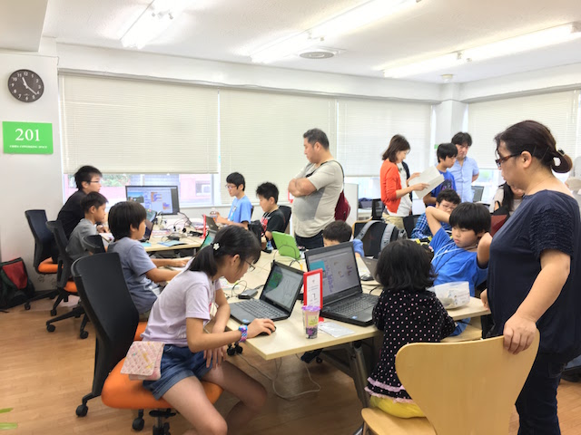
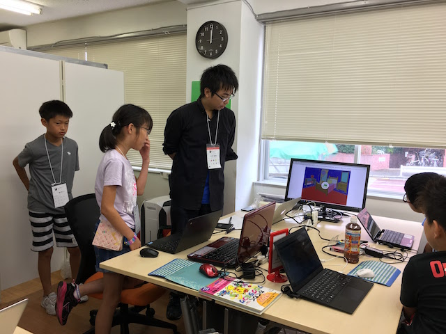

## 第41回 CoderDojo Chiba 開催レポート

2017年8月11日(金, 祝)に、[201千葉コーワーキング](http://chiba-coworking.com/) にて、第41回 CoderDojo Chiba が開催されました。

## 午前の部の様子

Ninja 7名と、メンター2名が参加しました。

今回も、5名に作っている作品を発表していただきました！

## 午後の部の様子

Ninja 5名が参加しました。

MineCraft MOD 作りのチャレンジでは、

- 食べると爆発を起こすアイテム
- 瞬間移動が可能になるアイテム

にチャレンジしました。

また、UnityにチャレンジしているNinjaもいましたよ！

## 次回予告

7月開催で、9,500円の寄付をいただきました。

今回は以下の支出が発生しています:

- 7月分会場費: 9,000円

次回開催は、9月18日(祝, 月) 敬老の日になります。

<a href="https://goo.gl/forms/6BCB8jzTkYpO6DEv1" target="_blank">応募はこちらから</a>
