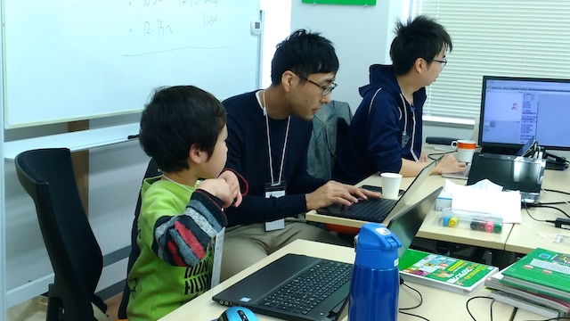

## 第46回 CoderDojo Chiba 開催レポート

2018年3月10日(土)に、[201千葉コーワーキング](http://chiba-coworking.com/) にて、第46回 CoderDojo Chiba が開催されました。

## 午前の部

Ninja6名と、メンター2人が参加しました。今回は新しいNinjaが2人参加です。

今回も3名のNinjaに、作品を発表していただきました。それぞれ個性豊かなゲームが出来ていましたよ！

## 午後の部

Ninja 2人が参加しました。なんと、4月から高校生のようです。
小学生から参加していた Ninja たちですが、なかなか感慨深いもんですね。

## 次回予告

3月開催で、8,300円の寄付をいただきました。

今回は以下の支出が発生しています:

- 3月分会場費: 5,000円

